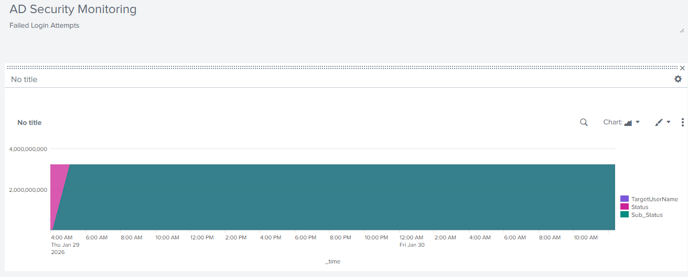
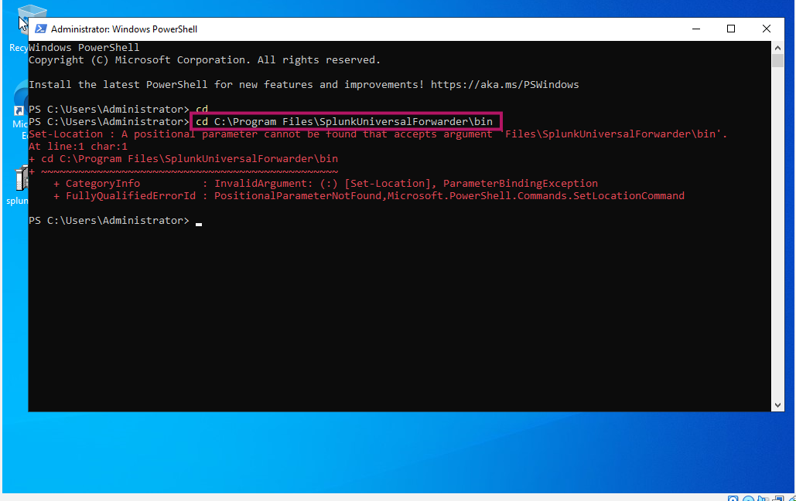

# 🛡️ Active Directory Security Monitoring with Splunk (SIEM)

## 📌 Project Overview

This project demonstrates the implementation of a centralized security monitoring system using **Splunk SIEM**. I configured a **Splunk Universal Forwarder** on a Windows Domain Controller to ingest security logs and created a customized dashboard to visualize potential security threats, such as Brute Force attacks.

## 🏗️ Technical Architecture

* **Splunk Indexer**: Local installation of Splunk Enterprise.
* **Data Source**: Windows Server 2022 (Active Directory Domain Controller).
* **Collector**: Splunk Universal Forwarder (UF).
* **Network**: Connected via Port **9997**.

| SIEM Dashboard Overview | Universal Forwarder Configuration |
| :--- | :--- |
|  |  |

---

## 🚀 Implementation Steps

### 1. Configuring Data Ingestion

Configured the `inputs.conf` file on the Windows Server to monitor specific security event logs:

```ini
[WinEventLog://Security]
disabled = 0
index = main

```

### 2. Security Analysis (SPL Queries)

I used the following **Search Processing Language (SPL)** queries to identify security incidents:

* **Detect Failed Logins (Event Code 4625):**
```splunk
index=* host="AD-DC-01" EventCode=4625 | stats count by TargetUserName

```


* **Purpose**: Identifying brute force attempts by monitoring failed authentication.


* **Detect Successful Logins (Event Code 4624):**
```splunk
index=* host="AD-DC-01" EventCode=4624 | table _time, TargetUserName, host

```


* **Purpose**: Tracking authorized access to the Domain Controller.


### 3. Security Dashboard

I built a custom dashboard named **"AD Security Monitoring"** to provide real-time visibility into the security posture of the environment.

---

## 🛠️ How to Use This Repository

1. Install **Splunk Enterprise** on your machine.
2. Deploy **Splunk Universal Forwarder** on a Windows target.
3. Point the UF to your Splunk Indexer IP on Port **9997**.
4. Copy the **SPL queries** provided above into the Splunk search bar.

---

